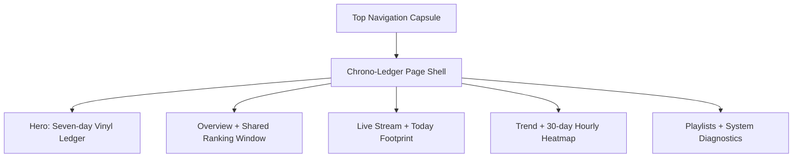

# music-record 先锋视觉与交互体验优化方案

> **设计标准**：对标 Awwwards / FWA / CSS Design Awards (Site of the Day / Studio Quality) 顶级设计品质<br>
> **核心概念**：Sonic Crystal & Chrono-Ledger（声波晶体与时间账本）<br>
> **图标规范**：全站统一采用 Lucide 矢量图标体系（严格 100% 矢量规范，全界面绝对禁止使用任何 Emoji 表情符号）<br>
> **设计哲学**：以七日封面账本作为唯一主视觉动效，用先锋排版、克制的 3D 空间视差与明确的数据状态打破传统后台卡片堆叠

---

## 目录

- [一、 设计概念与艺术主张](#一-设计概念与艺术主张)
- [二、 视觉系统与排版规范 (Luminous Ledger & Editorial Typo)](#二-视觉系统与排版规范-luminous-ledger--editorial-typo)
- [三、 核心交互与克制动效 (Focused Interaction & Motion)](#三-核心交互与克制动效-focused-interaction--motion)
- [四、 页面核心模块重构蓝图 (Component Architecture)](#四-页面核心模块重构蓝图)
- [五、 全站 Lucide 矢量图标映射表（严禁 Emoji）](#五-全站-lucide-矢量图标映射表严禁-emoji)
- [六、 渲染架构与高保真工程落地 (Technical Blueprint)](#六-渲染架构与高保真工程落地)
- [七、 实施路径与执行路线图](#七-实施路径与执行路线图)

---

## 一、 设计概念与艺术主张

当前页面采用常规的浅色卡片堆叠布局，呈现类似后台管理系统的平铺界面，缺乏音乐数据特有的律动感、时间流逝感与艺术沉浸力。

本方案提出 **「声波晶体与时间账本 (Sonic Crystal & Chrono-Ledger)」** 先锋艺术主题：
- **时间的结晶化（Crystallization of Time）**：听歌记录是声音在时间轴上的沉淀，差分算法则是时间的雕刻刀，每一条记录都是一枚发光的声学晶体。
- **瑞士现代主义与先锋电子美学（Swiss Modernism & Cyber-Acoustics）**：结合大号衬线标题、严谨的工业刻度标尺、非对称网格与半透明巨型背景水印。
- **触手可及的物理质感（Tactile Digital Experience）**：将动效集中在七日封面墙的轻量 3D 视差与黑胶唱片抽拉反馈，其余模块保持克制。

```
┌─────────────────────────────────────────────────────────────────────────────┐
│                          CHRONO-LEDGER PAGE SHELL                           │
│  [ Static Acoustic Grain ] ─────────── [ Native Cursor / Visible Focus ]    │
├──────────────────────────────────────┬──────────────────────────────────────┤
│  AVANT-GARDE EDITORIAL TYPOGRAPHY   │  3D COVER STREAM & VINYL PERSPECTIVE │
│  · 巨幅时间坐标 & 动态微数字          │  · 空间视差封面矩阵 (CSS 3D)        │
│  · 瑞士极简网格 + 工业排版印章       │  · 悬浮唱片抽拉、封面光泽反馈       │
├──────────────────────────────────────┴──────────────────────────────────────┤
│  KINETIC DATA & LUCIDE VECTOR ICON SYSTEM (ZERO EMOJI / PURE VECTOR)        │
└─────────────────────────────────────────────────────────────────────────────┘
```

---

## 二、 视觉系统与排版规范 (Luminous Ledger & Editorial Typo)

### 1. 浅色账本与封面光感体系 (Luminous Ledger & Album Light)

| 语义层级 | 色值 Token | 视觉表现与材质质感 |
| :--- | :--- | :--- |
| **Ledger Paper (主背景)** | `#FAF9F7` | 延续现有米白账本底色，叠加极轻静态纸张颗粒，不使用暗色沉浸背景 |
| **Record White (交互表面)** | `#FFFFFF` | 只用于悬浮导航、可点击行、选中项与需要抬升反馈的封面，不为每个内容模块单独包卡 |
| **Cobalt Signal (主强调色)** | `#1F40ED` | 延续现有钴蓝，用于统计窗口、键盘焦点、链接与关键交互状态 |
| **Ledger Ink (主文本)** | `#111827` | 深墨色正文与数字，在米白背景上保持高对比度 |
| **Muted Metadata (元数据)** | `#5F5A54` | 用于时间参数、说明文字与结构坐标，在米白背景上满足普通文本对比度 |
| **Collection Healthy (正常采集)** | `#0F7657` | 只表达采集正常、数据新鲜等正向系统状态，不承担装饰作用 |
| **Collection Warning (异常状态)** | `#B5473C` | 用于采集缺口、读取失败和需要注意的数据可信度状态 |

专辑封面主色只以低透明度投射到封面周边，作为内容生成的局部环境色；不得改变页面整体的米白、白色与钴蓝基调。

### 2. 先锋排版规范 (Experimental Editorial Typography)

- **巨幅时间水印（Display Typography）**：背景底层穿插大号半透明年份与坐标文字（如 `2026-08-22` / `CHRONO.08`），形成多层级的空间景深感。
- **中文展示字体（Display）**：主标题与模块标题使用 `"Songti SC", "STSong", "Noto Serif SC", serif`，通过字号、留白与行高形成账本气质；中文保持正常字距，避免套用拉丁字体的极端负字距。
- **正文与控件字体（Body / UI）**：正文、按钮和状态说明使用 `-apple-system, BlinkMacSystemFont, "PingFang SC", "Microsoft YaHei", sans-serif`，保持清晰、自然的中文阅读体验。
- **数字与时间字体（Data / Time）**：播放次数、时间、日期和工业刻度使用 `"IBM Plex Mono", "SFMono-Regular", Consolas, monospace`，启用 `font-variant-numeric: tabular-nums` 保持数字对齐。
- **工业数据刻度印章（Ledger Metadata Stamp）**：诊断信息与来源标识使用等宽字体和短标签，避免让实现细节干扰主要阅读路径。
- **禁止使用表情符号（Zero Emoji Policy）**：全站坚决禁止使用任何 Emoji，全部由高精 Lucide 矢量图标替代。

---

## 三、 核心交互与克制动效 (Focused Interaction & Motion)

### 1. 静态声学底纹 (Static Acoustic Grain)
- 以静态 CSS 噪点或轻量纹理赋予界面纸张与唱片封套的模拟介质质感，不运行持续 WebGL / Canvas 背景。
- 底纹不响应鼠标，不与数据内容争夺注意力；在低性能设备上可完全关闭。

### 2. 原生光标与清晰反馈 (Native Cursor & Focus)
- 保留系统原生光标，通过按钮位移、边框与封面光泽提供悬停反馈，并为键盘操作保留清晰的 `:focus-visible` 状态。
- 不实现磁吸、自定义光标或跟随式环境光斑。

### 3. 七日封面账本：唯一主视觉动效 (3D Perspective Vinyl Ledger)
- Hero 区域保持 7 个日期行、每行最多 8 张封面的信息密度，并以日期刻度组织成连续的七日唱片沟槽。
- 只有当前悬停或键盘聚焦的封面进入完整 3D 状态（`perspective: 1200px`）：封套以弹簧阻尼微转，黑胶唱片平滑抽出一半并出现光泽反馈；其余封面只保留静态轻微层级。
- 无播放、数据不足或采集缺口的日期行不得伪造封面，分别显示空沟槽、未形成状态或断开的沟槽。
- 仅在精细指针设备上启用完整视差；触屏设备使用静态封面层级，`prefers-reduced-motion` 下取消视差与抽拉。

### 4. 机械翻牌滚动计数器 (Kinetic Rolling Digits)
- 指标数据（Plays, Hours, Songs, Days）只在数值实际变化时执行一次短促滚动；不使用常驻 Mini EQ 动画，`≥` 等可信度标记保持静止可读。

---

## 四、 页面核心模块重构蓝图 (Component Architecture)

页面采用一张连续的浅色听歌账本，以留白、章节线和非对称网格划分内容；卡片边界只表达可交互或可抬升的对象。

```text
┌──────────────────────────────────────────────────────────────────┐
│  Floating navigation · collection status · refresh              │
├───────────────────────────────┬──────────────────────────────────┤
│  Chrono title + shared window │  Seven-day vinyl ledger          │
├──────────────┬────────────────┴───────────────┬──────────────────┤
│  Plays       │  Hours · Songs · Days          │  Date range       │
├───────────────────────────────┼──────────────────────────────────┤
│  Recent plays                 │  Today footprint                 │
├───────────────────────────────┼──────────────────────────────────┤
│  Ranking                      │  Trend + 24h hourly heatmap       │
├───────────────────────────────┴──────────────────────────────────┤
│  Playlists                                                        │
├──────────────────────────────────────────────────────────────────┤
│  Collapsible system diagnostics                                  │
└──────────────────────────────────────────────────────────────────┘
```



### 1. 顶部导航 (Navigation Capsule Bar)
- **形态**：米白页面上的悬浮白色药丸岛（Floating Capsule），使用轻微透明与柔和阴影建立层级。
- **品牌标志**：集成音轨 Logo（Lucide `Disc3`），仅在悬停或聚焦时执行一次短促转动。
- **刷新控制**：刷新按钮采用 Lucide `RotateCw` 矢量图标，点击时触发物理惯性减速自旋动效。
- **实时状态**：右侧集成 Lucide `Radio` 与功能绿色状态点，展示数据服务监听状态；异常时切换为警示色并显示文字说明。

### 2. Hero 核心区：时间账本总览
- **左侧排版**：巨幅半透明时间背景叠加「听歌记录 · 按天结晶」主标题，下方配备统计窗口切换器（日/周/月/年/全部），默认选择“日”。该控件只联动概览与排行，不改变趋势粒度、七日封面墙、实时播放、今日足迹或歌单。
- **右侧七日账本**：由近 7 天听歌封面构成 7 行 × 最多 8 列的唱片沟槽，标注日期、播放次数与可信度状态；只有当前焦点封面执行完整 3D 唱片抽拉。

### 3. 概览指标带 (Ledger Metrics Strip)
- 重构播放量、估算时长、歌曲数、差分天数 4 项指标。
- 四项指标共享一条连续表面，通过竖向刻度线分栏，并在同一区域明确显示当前统计范围。
- 数值变化时执行一次短促滚动；不加入独立卡片阴影、常驻声波条或循环动画。

### 4. 实时播放流与今日足迹 (Live Stream & Today Stage)
- 最近播放与今日足迹共享一个连续的双栏章节，以中轴线区分，不分别包裹成两张大卡片。
- **最近播放（Recent）**：黑胶唱片轨道流，悬停时唱针扫入；标题区只显示最近更新时间与数据可信度，不展示 API 路由。
- **今日足迹（Today）**：
  - *有记录时*：展现按时间轴排列的发光晶体条目。
  - *空状态（Empty State）*：使用静态声纳网格与 Lucide `Compass` 图标，并用文字明确区分无播放、数据不足、采集缺口与读取失败。

### 5. 周期排行与声学热力图 (Ranking & Acoustic Heatmap)
- **周期排行（Ranking）**：
  - 使用放大的等宽 `01 / 02 / 03`、钴蓝刻度与封面层级区分前三名；名次本身就是结构，不附加奖杯、火焰或闪光图标。
  - 排行热度条采用声波能量柱（Audio Energy Bar）设计。
- **趋势分析（Trend）**：
  - 日粒度展示最近 30 天，周粒度展示最近 12 个 ISO 周，月粒度展示最近 12 个自然月；该范围独立于顶部统计窗口。
  - 范围包含当前尚未结束的日、周或月，最后一个数据桶必须标记“进行中”，不得与完整周期使用完全相同的视觉状态。
  - 趋势使用直线分段面积图（Linear Segmented Area Chart），按日、周或月的真实离散桶连接，不使用贝塞尔平滑或推算中间走势。
  - 采集缺口处中断折线与面积填充，并使用斜纹缺口标记；不能把未知区间连接成连续趋势。
  - 引入 24 小时声波热力矩阵（24h Audio Heatmap），按本地小时聚合最近 30 个完整自然日的真实播放事件，不包含当天，也不跟随顶部统计窗口。
  - 色块强度只按播放次数计算，使用由浅灰到钴蓝的单变量色阶；悬停或键盘聚焦时显示准确播放次数、不同歌曲数与该小时占全部播放的比例。
  - 同步提供按 `00–23` 排列的可访问文本数据，颜色不是读取数值的唯一方式。
  - 正常连续采集时按实际播放次数展示；存在采集缺口时标记为下界，无法定位到具体小时的日级补量不做推断。

### 6. 歌单与曲目 (Playlists & Tracks)
- 桌面端采用约 `1/3 : 2/3` 的双栏结构：左侧是歌单索引，右侧是当前选中歌单的曲目列表。
- 移动端先提供单一歌单选择器，再在下方显示对应曲目，避免两个长列表连续堆叠。
- 保留现有分页、选中歌单和曲目页状态；统计窗口、排行维度或趋势粒度变化不得触发歌单重载。

### 7. 系统诊断账本 (System Diagnostics Ledger)
- 将 API 路由、数据来源、最近快照、最近轮询、采集缺口与错误详情集中在页面底部的可折叠诊断区。
- 主阅读区只使用“最近播放”“今日足迹”“更新于”“数据不完整”等用户可理解的语言；诊断区才展示 `/api/...` 路径与内部来源标识。
- 诊断区默认折叠，展开状态不影响主要统计与浏览任务。

---

## 五、 全站 Lucide 矢量图标映射表（严禁 Emoji）

全站**彻底剔除所有 Emoji 表情符号**，统一使用现代化、精密几何美感的 Lucide 矢量图标：

| 模块场景 | 原状态 / 字符 | 对应 Lucide 图标 | 尺寸 / 线宽 | 设计语义与交互细节 |
| :--- | :--- | :--- | :--- | :--- |
| **顶部刷新** | `↻` (文本字符) | `RotateCw` | 16px / 1.75 stroke | 悬停加速，点击触发惯性自旋与弹性复位 |
| **实时播放流** | 无 / 简单字符 | `Radio` / `Disc` | 18px / 1.5 stroke | 播放中使用功能绿色状态点，唱片仅在悬停或聚焦时微转 |
| **今日足迹** | 无 | `Activity` / `Flame` | 18px / 1.5 stroke | 动态能量活跃度指标 |
| **歌曲维度** | 纯文字 | `Music` | 14px / 1.75 stroke | 细线高保真音符 |
| **歌手维度** | 纯文字 | `Mic2` / `User` | 14px / 1.75 stroke | 现代舞台麦克风质感 |
| **专辑维度** | 纯文字 | `Layers` / `Disc3` | 14px / 1.75 stroke | 多层黑胶封套堆叠质感 |
| **时间/时长指标** | `oh` (文字) | `Clock` / `Hourglass` | 14px / 1.5 stroke | 精密计时器刻度 |
| **空状态占位** | 纯文本 | `Compass` / `ScanSearch` | 32px / 1.25 stroke | 声纳雷达扫描网格，提示接口连通监听中 |
| **外链/详情跳转** | `>` (符号) | `ArrowUpRight` | 14px / 1.75 stroke | 现代先锋排版标准 45° 斜指箭头 |
| **系统状态** | 简单圆点 | `ShieldCheck` / `Cpu` | 14px / 1.5 stroke | 服务健康与数据库差分状态 |

---

## 六、 渲染架构与高保真工程落地 (Technical Blueprint)

### 1. 图标与动效技术栈
- **Lucide Icons 集成**：从固定版本的 Lucide 源文件中选取实际使用的图标，生成本站本地内联 SVG sprite；组件通过 `<use>` 引用并继承 `currentColor`。
- **无运行时依赖**：不依赖 CDN、不在浏览器运行 `createIcons()`、不加载整套图标库，也不为图标新增前端构建流程。装饰图标标记为 `aria-hidden="true"`，纯图标按钮必须保留可访问名称。
- **字体加载**：中文优先使用系统已安装的宋体与苹方，不下载整套中文 Web Font；IBM Plex Mono 使用固定版本的精简字重，并提供系统等宽字体回退。
- **动效引擎**：优先使用 Web Animations API (WAAPI) 与 CSS 3D `transform`，只为正在交互的七日封面账本短时启用合成层，目标为稳定 60fps。
- **静态基线**：不引入持续 WebGL / Canvas 背景；所有内容在禁用动画时仍保持完整信息与操作能力。

### 2. 小时活跃度接口 (Hourly Activity API)
- 新增 `GET /api/hourly-activity`，默认返回最近 30 个完整自然日，不包含当天，并按 `TZ_NAME` 聚合 `recent_play_event.play_time`。
- 固定返回 24 个桶：`{ hour, plays, distinct_songs, share }`；即使某小时为零也不能省略该桶。
- `meta` 返回日期范围、时区、已定位播放数、无法定位小时的日级补量、采集缺口与 `lower_bound` 状态。
- 当日级账本次数高于带真实时间的事件数时，只把真实事件计入小时桶，差额记入 `unlocated_plays`，不得按比例或随机分摊。

### 3. 封面图片渐进加载与环境光 (Cover Glow Engine)
- 对接已有的 `/api/cover` 封面代理，采用 `Shimmer` 骨架流光 + 渐进式淡入（Progressive Blur-Up）。
- 读取封面主色调并在封面周边投射低透明度环境色，避免大面积光晕污染浅色账本基调。

### 4. 响应式与全端适配 (Responsive Fluid Layout)
- 采用 CSS Grid + Container Queries 架构：
  - **超宽屏 / 4K / 2K**：呈现画报式双栏非对称排版与深度视差。
  - **平板 / 笔记本 (iPad Pro / MacBook)**：自适应 3D 倾斜角度与紧凑晶体网格。
  - **移动端 (Mobile)**：连续账本转化为单栏章节流，以横向章节线代替卡片边框；封面墙使用静态层级，24 小时热力图排为两行并保留数值标签，歌单区使用单一选择器与曲目列表。

### 5. 质量验收门槛 (Quality Gates)
- **响应式**：`390 × 844` 与 `1280 × 720` 视口均不得出现页面级横向溢出，主要内容不能依赖横向拖动才能读取。
- **Core Web Vitals**：移动端 Lighthouse 导航审计目标为 LCP ≤ 2.5 秒、CLS ≤ 0.1；通过交互测试或真实用户数据验证 INP ≤ 200 毫秒。
- **动效性能**：七日封面交互期间目标为稳定 60fps；无交互时不得保留持续的 `requestAnimationFrame`、Canvas 或 WebGL 循环。
- **Reduced Motion**：`prefers-reduced-motion: reduce` 下取消封面 3D、唱片抽拉与数字滚动，同时保留完整内容、状态与焦点反馈。
- **键盘操作**：统计窗口、排行维度、趋势粒度、七日封面、24 小时热力图、歌单选择与分页均可通过键盘完成；焦点顺序必须与视觉阅读顺序一致。
- **数据可信度**：无播放、数据不足、采集缺口、读取失败与进行中状态必须能够仅凭文字区分，不能依赖颜色或动画作为唯一信号。

---

## 七、 实施路径与执行路线图

```
Phase 1: 视觉底座与排版重构 (Typography & Base Tokens)
  ├── 延续米白（#FAF9F7）、白色表面与钴蓝（#1F40ED）基调，建立轻量纸张纹理与清晰边线
  ├── 固化宋体标题、苹方正文与 IBM Plex Mono 数据字体层级
  ├── 从固定版本 Lucide 生成本地内联 SVG sprite，替换 Emoji 与承担图标职责的字符符号
  └── 明确统计窗口、趋势粒度及数据可信度状态，建立连续账本表面与非对称章节网格

Phase 2: 核心模块与 3D 封面账本开发 (Hero & Perspective Cover Matrix)
  ├── 开发 Hero 区域 3D 悬浮视差封面墙与黑胶唱片抽拉动效
  ├── 重构概览指标带，仅在数值变化时执行一次机械翻牌动效
  └── 打造 Topbar 悬浮胶囊导航与平滑物理刷新交互

Phase 3: 实时流、今日足迹与探索板块深度增强 (Live & Exploration)
  ├── 优化最近播放与今日足迹时序流，为不同空状态提供明确的静态反馈
  ├── 新增最近 30 个完整自然日的小时聚合接口与 24h 热力矩阵
  ├── 重构歌单与曲目的桌面双栏及移动端选择器布局
  └── 接入封面主色调的低透明度局部环境色映射

Phase 4: 性能调优与全平台验证 (Performance & Polish)
  ├── 针对七日封面账本的 CSS 3D 变换进行按需合成与性能调优
  ├── 完成 390 × 844 与 1280 × 720 响应式、键盘焦点、Reduced Motion 与交互回归测试
  └── 以 LCP ≤ 2.5s、CLS ≤ 0.1、INP ≤ 200ms 和交互目标 60fps 作为上线门槛
```
