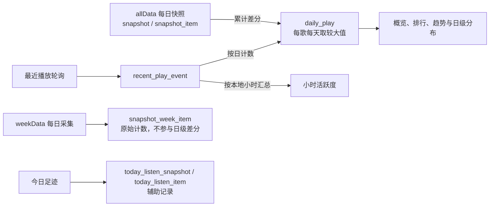

# music-record

<p align="center">
  
</p>

> 网易云音乐个人听歌统计：通过最近播放事件和每日累计快照生成本地记录，提供歌曲、歌手、专辑排行与播放趋势。


网易云的听歌排行接口提供 **allData 累计计数**和 **weekData 最近一周计数**，没有完整的逐次播放记录。`music-record` 默认每 60 秒轮询最近播放，按歌曲、播放时间和来源类型去重保存事件；每天采集累计快照，再将累计差分与事件计数按每首歌、每天取较大值，保存到本地 SQLite。

项目有两个直接运行时依赖（Fastify + Luxon）；数据库、测试、`.env` 加载和 `fetch` 使用 Node.js 内置能力，无需编译。

## 特性

- **快照差分**：计算同一首歌相邻可见快照的累计差值；首次出现的歌曲不计算差分，跨多日增量标记日期归属不确定。
- **双数据源合并**：最近播放事件计数与 allData 差分按每首歌、每天取较大值。
- **滚动窗口统计**：歌曲 / 歌手 / 专辑三个维度；日 / 周 / 月 / 年对应滚动 1 / 7 / 30 / 365 天，另支持全部已记录历史。
- **可视化统计**：概览、排行、播放趋势、七日歌曲封面、24 小时活跃度、日历热力与周几分布。
- **进程内定时采集**：最近播放默认每 60 秒轮询，每日快照默认 04:00 采集，无需 cron。
- **数据质量标注**：概览、排行等统计提供下界状态，前端以 `≥ X` 标注；趋势区分数据未知与已确认的零播放。
- **歌单与封面**：同步用户歌单及曲目到本地数据库，网易云封面支持磁盘缓存。
- **容器部署**：提供 Dockerfile + Compose，支持多阶段构建、非 root 运行、数据卷持久化和健康检查。

## 工作原理



allData 存在传播延迟，因此默认在 04:00 采集，并以 `ATTRIBUTION=prev` 将差分归到快照日的前一天。若在当天 23:55 采集，可设为 `same`。但是，`ATTRIBUTION` 只决定差分增量归到哪一天，无法还原每次播放的实际时间；最近播放事件则按自身时间戳和统计时区归属。

> [!NOTE]
> **第一张累计快照只建立差分基线**。但是，首次采集也会读取最近播放；如果接口返回带有效时间戳的歌曲，事件计数可以立即产生统计。

最近播放接口仅提供每首歌最近一次播放的信息，因此轮询之间的重复播放仍可能遗漏。累计差分只能覆盖榜单中可见的歌曲，因此开始采集之前的逐日历史无法由这些数据恢复。

## 快速开始

### 环境要求

- **Node.js 22，版本不低于 22.13.0**。当前启动命令不带 `--experimental-sqlite`，而 `node:sqlite` 自 22.13.0 起才默认启用；详见 [Node.js 文档](https://github.com/nodejs/node/blob/v22.17.0/doc/api/cli.md#--no-experimental-sqlite)。
- 一个网易云音乐账号

### 1. 安装

```bash
git clone <repo-url> music-record
cd music-record
npm install
```

### 2. 配置

复制环境变量模板并填入你的信息：

```bash
cp .env.example .env
```

填写以下两项：

```ini
NETEASE_UID=你的网易云UID
NETEASE_COOKIE=MUSIC_U=xxxxxxxx...
```

> [!IMPORTANT]
>
> - **在网易云客户端将听歌排行设为「公开」**，以便采集排行数据。
> - `NETEASE_COOKIE` 填写登录后的 `MUSIC_U`，可从网页版浏览器开发者工具获取。Cookie 缺失或失效时，可能无法读取有效计数或登录态数据。

### 3. 初始化数据库

```bash
npm run migrate
```

### 4. 执行首次采集

```bash
npm run collect
```

该命令采集累计快照、最近播放、今日足迹、歌单及曲目。首次累计快照用于建立基线；最近播放中的有效事件可以立即计入统计。

### 5. 启动 API 与前端

```bash
npm run api
```

访问 <http://127.0.0.1:3000> 查看前端，或访问 <http://127.0.0.1:3000/api> 查看端点列表。

> [!TIP]
> API 启动后默认立即采集一次最近播放，然后按配置间隔继续轮询；每日完整采集在 `COLLECT_AT` 指定的时间执行。因此，日常只需保持 `npm run api` 运行。`COLLECT_IN_API=0` 和 `REALTIME_IN_API=0` 分别关闭这两项任务。

## 配置项

配置通过环境变量提供，[`src/config.js`](src/config.js) 启动时自动加载项目根目录的 `.env`：

| 变量 | 默认值 | 说明 |
| --- | --- | --- |
| `NETEASE_UID` | *（必填）* | 你的网易云 UID，听歌排行需设为公开 |
| `NETEASE_COOKIE` | *（必填）* | 登录 Cookie，只需 `MUSIC_U` 一项 |
| `TZ_NAME` | `Asia/Shanghai` | 统计时区；趋势周桶采用 ISO 周 |
| `ATTRIBUTION` | `prev` | 差分归属：`prev`=归前一天 / `same`=归当天 |
| `DB_PATH` | `data/music.db` | SQLite 数据库路径 |
| `COVER_CACHE_DIR` | 数据库目录下的 `cover-cache` | 封面磁盘缓存目录；默认是 `data/cover-cache` |
| `COVER_CACHE_TTL_MS` | `2592000000`（30 天） | 服务端缓存有效期；最小 1 小时，过期后在下一次请求时刷新 |
| `COVER_CACHE_MAX_BYTES` | `3145728`（3 MiB） | 单张封面大小上限；最小 64 KiB |
| `API_PORT` | `3000` | API 服务端口 |
| `API_HOST` | `127.0.0.1` | 绑定地址 |
| `COLLECT_IN_API` | `1` | 是否在 API 进程内执行每日完整采集及首次歌单同步；设 `0` 关闭 |
| `COLLECT_AT` | `04:00` | 按 `TZ_NAME` 时区执行每日完整采集的时刻，格式为 `HH:mm` |
| `COLLECT_ON_START` | `0` | 设 `1` 后，若当天没有累计快照，则启动时立即执行完整采集；依赖 `COLLECT_IN_API=1` |
| `REALTIME_IN_API` | `1` | 是否在 API 进程内运行最近播放计数器 |
| `REALTIME_INTERVAL_MS` | `60000` | 最近播放轮询间隔（最低 15000ms） |
| `REALTIME_LIMIT` | `300` | 定时轮询每次请求的条数，取值限制为 1–300；客户端实际最多请求 100 条 |

`REALTIME_LIMIT` 控制定时轮询；`collect` 和 `collect:realtime` 使用各自的默认请求条数，同样受客户端 100 条上限限制。`COLLECT_ON_START=1` 可能在白天采集快照，因此启用前应确认采集时刻与 `ATTRIBUTION` 的日期归属一致。

> [!WARNING]
> 本服务**无鉴权**，提供个人听歌与歌单数据。直接运行时保持 `API_HOST=127.0.0.1`；需要公网访问时，通过反向代理配置 HTTPS 和鉴权。Compose 在容器内绑定 `0.0.0.0`，宿主端口仍只绑定 `127.0.0.1`。`.env` 含登录 Cookie，应保持私密。

## npm 脚本

| 命令 | 作用 |
| --- | --- |
| `npm run migrate` | 建表 / 迁移数据库结构 |
| `npm run collect` | 采集累计与一周快照，计算差分，并采集最近播放、今日足迹、歌单及曲目 |
| `npm run collect:realtime` | 只采集实时接口（今日足迹 / 最近播放） |
| `npm run api` | 启动只读 API + 前端（含进程内调度器） |
| `npm run rebuild` | 清空 `daily_play`，依次重放累计快照差分与最近播放事件，重新合并日级计数 |
| `npm test` | 运行测试（Node 内置 `node:test`） |
| `npm run probe` | 运行探针，实测 allData 更新延迟（见下） |

## API 端点

所有端点使用 `GET`。统计与歌单查询读取本地数据库；`/api/netease/*` 实时请求网易云，`/api/cover` 返回缓存或新获取的图片。

| 端点 | 说明 |
| --- | --- |
| `GET /api/health` | 最近快照、最近轮询时间、采集缺口与可用统计窗口 |
| `GET /api/overview` | 总览：总播放、时长估算、Top 歌/歌手/专辑、周环比 |
| `GET /api/ranking` | 多维排行（`dimension` × `metric` × `period`） |
| `GET /api/trend` | 趋势时序（可按歌曲 / 歌手 / 专辑过滤） |
| `GET /api/hourly-activity` | 默认最近 30 个完整自然日的小时事件分布，始终排除今天 |
| `GET /api/daily-top-songs` | 默认最近 7 天、包含结束日期当天的每日歌曲排行与封面 |
| `GET /api/calendar` | GitHub 贡献图式的日历热力 |
| `GET /api/weekday` | 周几听歌分布，排除日期归属不确定的增量 |
| `GET /api/playlists` · `GET /api/playlists/:id/tracks` | 本地保存的用户歌单与歌单曲目，支持分页 |
| `GET /api/cover?url=...` | 网易云封面缓存，`url` 为经过 URL 编码的图片地址 |
| `GET /api/netease/record/recent/song` | 最近播放，支持 `limit`，默认 30、最多 100 条 |
| `GET /api/netease/listen/data/today/song` | 网易云今日足迹 |
| `GET /api/netease/song/detail` | 歌曲详情，使用 `ids` 或 `id`，多个 ID 以逗号分隔 |

### 常用查询

`overview` 和 `ranking` 的 `period` 支持 `day / week / month / year / all`，默认 `all`；`date` 为窗口结束日期，默认今天。日 / 周 / 月 / 年对应包含结束日期在内的滚动 1 / 7 / 30 / 365 天；`all` 表示本地已记录历史。排行的 `dimension` 支持 `song / artist / album`，`metric` 支持 `plays / duration`，默认按歌曲播放次数排序。

`trend` 使用 `from / to` 指定日期范围，或用 `last` 指定截至 `to` 的时间桶数量；`granularity` 支持 `day / week / month / year`，默认 `day`。周桶采用 ISO 周，月桶与年桶按自然月、自然年划分。省略 `from` 时，默认范围不会早于本地记录起点。

```bash
# 最近 7 天歌曲排行，按播放次数排序，返回前 20 首
curl 'http://127.0.0.1:3000/api/ranking?dimension=song&metric=plays&period=week&limit=20'

# 最近 30 天按日汇总的播放趋势
curl 'http://127.0.0.1:3000/api/trend?granularity=day&last=30'

# 最近 30 个完整自然日的小时分布，不含今天
curl 'http://127.0.0.1:3000/api/hourly-activity?days=30'

# 第一页本地歌单
curl 'http://127.0.0.1:3000/api/playlists?limit=30&offset=0'
```

时长字段按歌曲时长乘以记录次数估算，因此不等同于实际收听时长。

### 返回字段与数据质量

各端点的字段结构不同：

| 端点 | 范围、质量与新鲜度字段 |
| --- | --- |
| `overview` | `meta.period_resolved`、`meta.data_quality`；实际查询范围在顶层 `range`，新鲜度在顶层 `freshness` |
| `ranking` | `meta.period_resolved`、`meta.data_quality`、`meta.freshness` |
| `trend` | `meta.range`、`meta.data_quality`、`meta.freshness`，并在每个时间桶标注质量状态 |
| `daily-top-songs` | `meta.range`、`meta.data_quality`、`meta.freshness`，并提供逐日下界状态 |
| `hourly-activity` | `meta.range`、`meta.timezone`、`meta.data_quality`、`meta.lower_bound` 及事件覆盖信息 |
| `calendar` | `meta.year`、`meta.metric`、`meta.max`，逐日提供 `estimated / missing`；没有 `data_quality` 字段 |
| `weekday` | `meta.range`、`meta.excluded_estimated_plays`；没有 `data_quality` 字段 |

`data_quality.lower_bound=true` 表示计数是已确认的最低值；可能原因包括历史覆盖不足、采集缺口或轮询数据过期。`overview`、`ranking`、`trend`、`calendar` 和 `weekday` 在数据不足时会返回 HTTP 200 及 `insufficientData: true`、`haveDays`、`needDays`，此时不返回常规的 `meta` 和统计结果。

趋势的每个时间桶还提供 `lower_bound`、`has_gap`、`estimated`、`missing` 和 `is_current`。有记录但覆盖不完整的桶保留计数并标为下界；未知的空桶标记 `missing=true`。前端以 `≥` 表示下界，未知数据处中断连线，虚线仅表示进行中的时间桶。

`hourly-activity` 固定返回 `hour=0–23` 共 24 个桶，只统计可定位到小时的真实事件。`meta.located_plays` 为可定位事件数，`meta.ledger_plays` 为日级总次数，`meta.unlocated_plays` 为按日比较后无法定位到小时的次数；无法定位的次数不会分摊到小时桶。`days` 支持 1–365，亦可使用 `from / to`；结束日期最晚为昨天。

### 歌单同步与封面缓存

每日完整采集和 `npm run collect` 都会同步歌单列表及曲目。歌单保存的是最近一次成功同步的状态，因此手机端的变更要等下一次同步后才会显示。启用 `COLLECT_IN_API` 且本地歌单表为空时，API 启动后会立即同步歌单，即使 `COLLECT_ON_START=0` 也会执行。读取本地歌单接口本身不会触发同步。

`/api/cover` 仅接受 `music.126.net` 及其子域名的图片地址，统一请求 HTTPS 和 160×160 尺寸。服务端缓存默认有效 30 天；过期刷新失败且已有缓存时，继续返回旧图。`COVER_CACHE_MAX_BYTES` 限制单张图片大小；缓存目录目前没有总容量限制，也不会自动清理过期文件。

## 数据模型

| 数据 | 表与用途 |
| --- | --- |
| 累计与一周快照 | `snapshot / snapshot_item / snapshot_week_item`。每个日期保存一组快照，同日再次采集会覆盖；仅 allData 参与累计差分 |
| 最近播放事件 | `recent_play_event`。以 `(song_id, play_time, source_type)` 去重，作为按日计数和小时活跃度的数据来源 |
| 辅助采集记录 | `recent_play_snapshot / recent_play_item` 保存 `collect` 与 `collect:realtime` 请求到的最近播放列表；`today_listen_snapshot / today_listen_item` 保存今日足迹，今日足迹不参与日级计数 |
| 歌曲维度 | `song / artist / album / song_artist`，采集时新增或更新 |
| 日级统计 | `daily_play`，合并累计差分与事件计数；概览、排行、趋势、每日歌曲、日历和周几分布查询此表 |
| 歌单 | `playlist / playlist_track`，保存最近一次成功同步的歌单与曲目状态 |
| 采集状态 | `counter_poll_gap / collection_log / meta`，记录轮询缺口、执行日志与计数器状态 |

`npm run rebuild` 会在事务中清空 `daily_play`，按日期重放 allData 快照差分，再重放 `recent_play_event` 并取较大值。因此，完整重建需要保留累计快照和播放事件两类数据。`weekData` 与今日足迹不参与重建，小时活跃度直接查询播放事件。

完整结构见 [`src/db/schema.sql`](src/db/schema.sql)。

## Docker 部署

项目自带多阶段 Dockerfile 与 Compose 编排，使用 Node.js 22 镜像。采集由 API 进程调度，无需额外容器或 cron：

```bash
# 在项目根建好 .env（填 NETEASE_UID / NETEASE_COOKIE）
docker compose up -d --build

docker compose logs -f   # 查看日志
docker compose down      # 停止
```

容器入口会先执行数据库迁移，再启动 API。默认启动时立即轮询最近播放，并在歌单表为空时同步歌单；累计快照在下一次 `COLLECT_AT` 执行。需要立即建立首张累计快照时，可执行：

```bash
docker compose exec music-record npm run collect
```

数据库和默认封面缓存目录通过命名卷 `music-data` 挂载到 `/app/data` 持久化，容器重建后数据仍保留。端口默认只映射到宿主 `127.0.0.1:3000`。若修改 `API_PORT`，需要一并修改 Compose 的端口映射；若修改数据库或缓存路径，应确保新路径仍位于持久化卷内。

## 探针（进阶）

`play/record` 的 allData 从实际播放到接口可见存在传播延迟。`src/probe/` 提供采样工具，用来测量该延迟并校准采集时间和 `ATTRIBUTION` 规则：

```bash
npm run probe           # 采样一次
npm run probe:watch     # 持续采样，已登记的实验窗口内自动提高采样频率
npm run probe:analyze   # 分析已采集的延迟数据
```

> [!NOTE]
> 探针用于研发标定，日常采集无需启动。分析播放延迟前，需要先用 `npm run stimulus` 登记播放实验；具体子命令见 [`src/probe/stimulus.js`](src/probe/stimulus.js)。

## 项目结构

```
src/
├── api/          Fastify 服务、统计与代理路由、封面缓存
├── collector/    每日快照、播放事件、歌单同步与进程内调度
├── netease/      网易云接口客户端与 weapi/eapi 加密
├── aggregate/    周期解析（periods）与聚合 SQL（queries）
├── db/           schema / migrate / rebuild / 连接管理
├── probe/        allData 更新延迟标定探针
└── config.js     集中配置（环境变量覆盖）
public/           轻量前端（原生 ESM，无框架）
scripts/          Windows .cmd 启动 / 采集 / 探针包装
test/             node:test 单元测试
```
